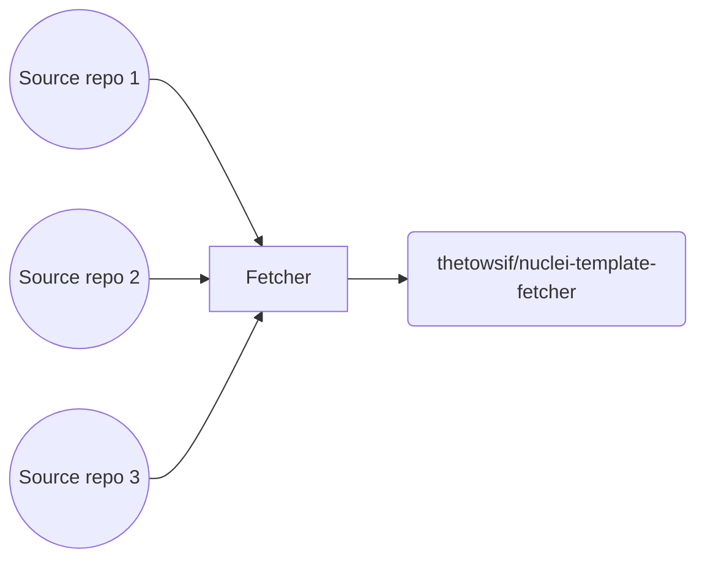

# Nuclei Template Fetcher
### This Repository only collects Nuclei templates from open-source GitHub projects.

[Nuclei](https://github.com/projectdiscovery/nuclei) is used to send requests across targets based on a template, leading to zero false positives and providing fast scanning on a large number of hosts. [Nuclei](https://github.com/projectdiscovery/nuclei) offers scanning for a variety of protocols, including TCP, DNS, HTTP, SSL, File, Whois, Websocket, Headless, etc. With powerful and flexible templating, Nuclei can be used to model all kinds of security checks.

This repository fetches nuclei templates from 153 repositories. You will get the templates in [community-templates](https://github.com/thetowsif/nuclei-template-fetcher/tree/master/community-templates). The purpose of this repository is to share templates from different sources, Check templates before running them you might have so modify some templates for avoiding false negative. Hack manually!

### If you have any query
* Twitter => [@thet0wsif](https://twitter.com/thet0wsif)

#

# 

